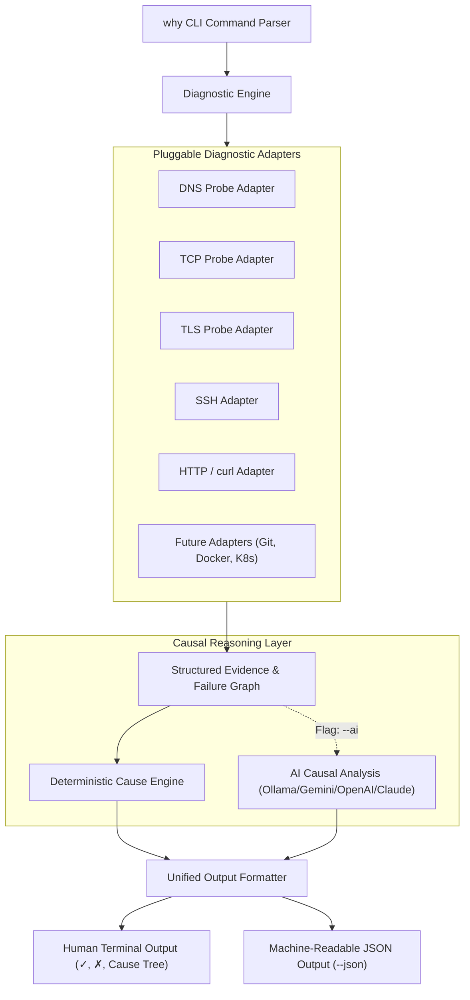
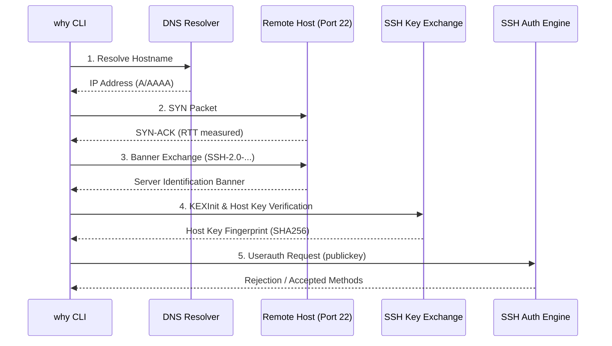
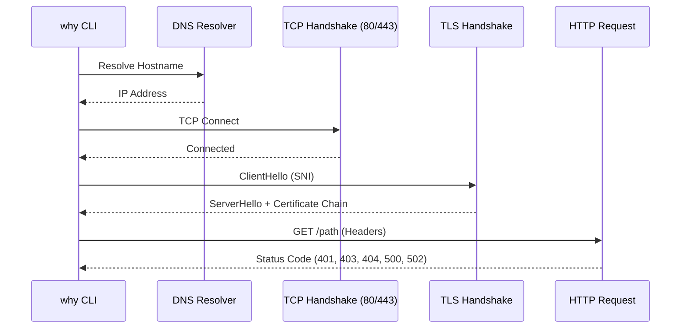

# Architecture & Philosophy of `why`

> **"Don't just tell me that it failed. Tell me why."**

`why` is designed as a Unix-native troubleshooting framework. Unlike traditional diagnostic utilities that dump raw logs or run isolated checks, `why` constructs a **machine-readable failure graph** and performs **causal reasoning** to explain the exact stage and root cause of a failure.

---

## 1. Core Architecture

The foundational design principle of `why` is the **strict separation of diagnostics from explanation**:

1. **Diagnostic Adapters** run network and protocol probes and collect structured evidence (facts). Adapters **never** format human text.
2. **The Cause Engine** inspects structured facts across the probe graph, correlates dependencies, and generates causal deductions and remediation steps.
3. **The Output Formatter** renders human-friendly ANSI terminal trees or machine-readable JSON.
4. **Optional AI Layer** synthesizes complicated failure graphs into enriched contextual playbooks when requested.



---

## 2. Structured Evidence Model

Every probe executed by an adapter emits structured evidence conforming to a unified data contract:

```go
type Diagnostic struct {
    Target       string                 `json:"target"`
    Protocol     string                 `json:"protocol"`
    Timestamp    time.Time              `json:"timestamp"`
    Status       string                 `json:"status"` // "passed", "failed"
    FailedAt     string                 `json:"failed_at,omitempty"`
    TotalElapsed string                 `json:"total_elapsed"`
    Checks       []Check                `json:"checks"`
    Failure      *Failure               `json:"failure,omitempty"`
    Causes       []Cause                `json:"causes,omitempty"`
    AIAnalysis   string                 `json:"ai_analysis,omitempty"`
}
```

### Check
Represents an individual step or probe in the diagnostic pipeline:
- `Name`: Human-readable probe title (e.g. `TCP Connect :22`)
- `Stage`: Canonical stage identifier (`dns`, `tcp`, `tls`, `ssh_handshake`, `authentication`)
- `Status`: `passed`, `failed`, `warning`, `skipped`
- `Evidence`: Key-value map of raw facts (`rtt`, `ip`, `cipher_suite`, `methods_accepted`)
- `Duration`: Monotonic probe execution time

### Failure & Causes
When a check fails:
- The adapter populates `Failure` with the failure point and raw evidence.
- The `CauseEngine` iterates over the evidence and generates `Cause` hypotheses:
  - `Explanation`: Direct, concise explanation of the root cause.
  - `Confidence`: `high`, `medium`, `low`.
  - `Remediation`: Copy-pasteable terminal commands to resolve the issue.

---

## 3. Protocol Pipelines

### SSH Pipeline


If authentication fails, `why` extracts the offered keys vs accepted methods and explains:
- Whether the remote server rejected the key
- If `~/.ssh/authorized_keys` permissions are wrong
- If sshd configuration restricts the user

### HTTP / curl Pipeline


---

## 4. Deterministic Core + AI Enhancement

`why` is strictly **offline-first and deterministic**:
- 100% of standard causal deductions work without any internet access, API keys, or LLMs.
- When `--ai` is enabled, the structured evidence graph is sent to local Ollama (`llama3.2`) or cloud providers (Gemini, OpenAI, Claude) to provide extended contextual diagnosis.
